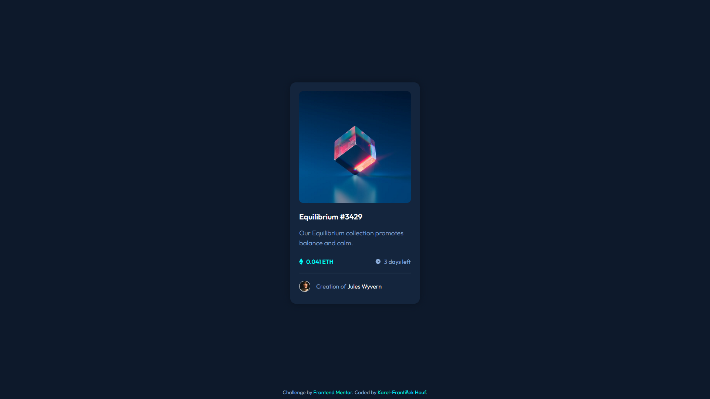
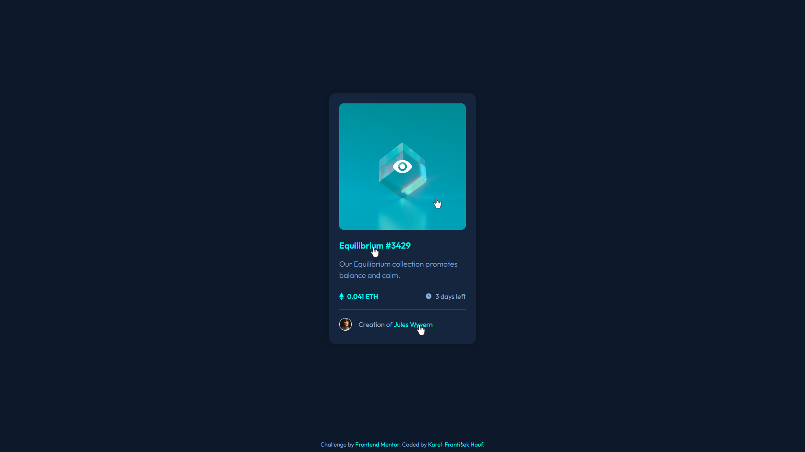

# Frontend Mentor - NFT preview card component solution

This is a solution to the [NFT preview card component challenge on Frontend Mentor](https://www.frontendmentor.io/challenges/nft-preview-card-component-SbdUL_w0U). Frontend Mentor challenges help you improve your coding skills by building realistic projects. 

## Table of contents

- [Frontend Mentor - NFT preview card component solution](#frontend-mentor---nft-preview-card-component-solution)
  - [Table of contents](#table-of-contents)
  - [Overview](#overview)
    - [The challenge](#the-challenge)
    - [Screenshot](#screenshot)
    - [Links](#links)
  - [My process](#my-process)
    - [Built with](#built-with)
    - [What I learned](#what-i-learned)
    - [Continued development](#continued-development)
    - [Useful resources](#useful-resources)
  - [Author](#author)

## Overview

### The challenge

Users should be able to:

- View the optimal layout depending on their device's screen size
- See hover states for interactive elements

### Screenshot

FullScreen


Active hover effects


### Links

- Solution URL: [GitHub](https://github.com/karelfh/mentor-nft-preview-card-component-main)
- Live Site URL: [GitHub Pages](https://karelfh.github.io/mentor-nft-preview-card-component-main/)

## My process

### Built with

- Semantic HTML5 markup
- CSS custom properties
- Flexbox

### What I learned

In this challenge, I finally learned how to overlay one element with another using absolute and relative positions.

Parent element has position relative.
```css
.card-image-container {
  position: relative;
}
```

Child element has position absolute, with top, bottom, left, and the right set to 0. Height and width are set to 100% to cover the whole parent element.
```css
.image-overlay {
  position: absolute;
  top: 0;
  bottom: 0;
  left: 0;
  right: 0;
  height: 100%;
  width: 100%;
}
```

### Continued development

In future projects, I want to get better at naming classes in HTML/CSS and write more effective HTML and CSS with no unnecessary code.

### Useful resources

- [W3School Overlay on hover](https://www.w3schools.com/howto/howto_css_image_overlay.asp) - This helped me with the hover effect over the NFT image.

## Author

- GitHub - [karelfh](https://github.com/karelfh)
- Frontend Mentor - [@karelfh](https://www.frontendmentor.io/profile/karelfh)
